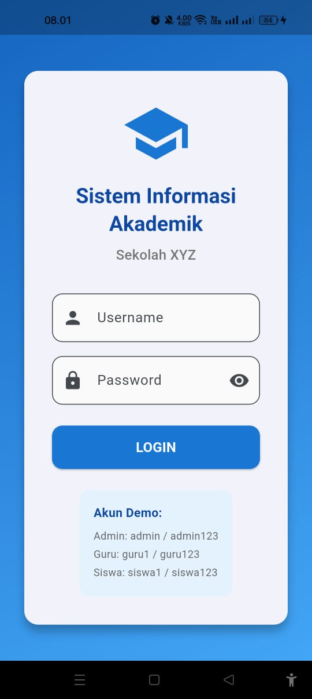
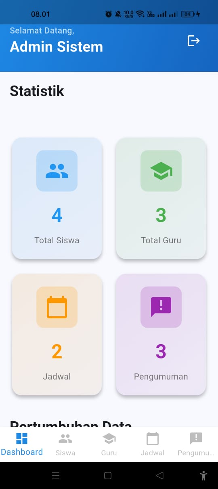
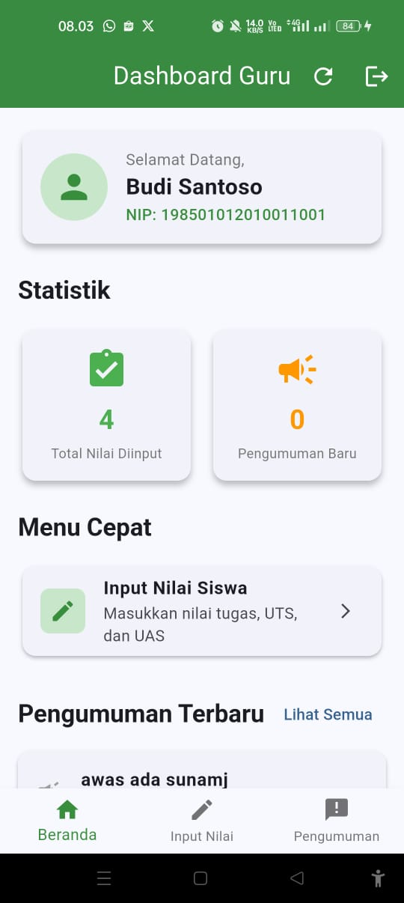
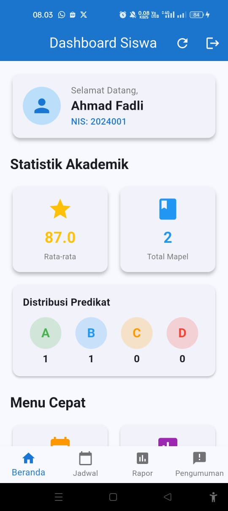

# Sistem Informasi Akademik

Aplikasi mobile untuk manajemen sistem informasi akademik sekolah yang dibangun menggunakan Flutter. Aplikasi ini menyediakan fitur lengkap untuk admin, guru, dan siswa dalam mengelola data akademik.

## 📱 Fitur Utama

### Admin

- Manajemen data siswa
- Manajemen data guru
- Manajemen jadwal pelajaran
- Manajemen pengumuman
- Laporan akademik

### Guru

- Melihat jadwal mengajar
- Input dan kelola nilai siswa
- Melihat pengumuman
- Cetak laporan nilai

### Siswa

- Melihat jadwal pelajaran
- Melihat nilai akademik
- Melihat pengumuman
- Cetak kartu hasil studi

## 🛠️ Teknologi yang Digunakan

- **Framework**: Flutter 3.9.0
- **State Management**: Provider 6.1.1
- **Local Database**: SQLite (sqflite 2.4.1)
- **PDF Generation**: pdf 3.11.1, printing 5.13.4
- **UI Components**:
  - Google Fonts 6.2.1
  - Cupertino Icons 1.0.8

## 📸 Screenshots

### Halaman Login



Halaman login untuk masuk ke sistem sebagai Admin, Guru, atau Siswa.

### Dashboard Admin



Dashboard admin dengan akses penuh untuk mengelola data siswa, guru, jadwal, dan pengumuman.

### Dashboard Guru



Dashboard guru untuk mengelola nilai siswa dan melihat jadwal mengajar.

### Dashboard Siswa



Dashboard siswa untuk melihat jadwal pelajaran, nilai, dan pengumuman.

## 🚀 Cara Menjalankan

### Persyaratan

- Flutter SDK 3.9.0 atau lebih tinggi
- Dart SDK
- Android Studio / VS Code dengan Flutter Extension
- Emulator Android atau iOS / Perangkat fisik

### Langkah-langkah

1. Clone repository ini

```bash
git clone https://github.com/Fahmi1945/sistem-akademik.git
cd sistem_informasi_akademik
```

2. Install dependencies

```bash
flutter pub get
```

3. Jalankan aplikasi

```bash
flutter run
```

## 📦 Struktur Proyek

```
lib/
├── main.dart                        # Entry point aplikasi
├── database/
│   └── database_helper.dart        # SQLite database helper
├── models/                          # Model data
│   ├── guru.dart                   # Model Guru
│   ├── jadwal.dart                 # Model Jadwal
│   ├── nilai.dart                  # Model Nilai
│   ├── pengumuman.dart             # Model Pengumuman
│   ├── siswa.dart                  # Model Siswa
│   └── user.dart                   # Model User
├── providers/                       # State management dengan Provider
│   ├── auth_provider.dart          # Provider autentikasi
│   ├── guru_provider.dart          # Provider data guru
│   ├── jadwal_provider.dart        # Provider jadwal pelajaran
│   ├── nilai_provider.dart         # Provider nilai siswa
│   ├── pengumuman_provider.dart    # Provider pengumuman
│   └── siswa_provider.dart         # Provider data siswa
├── screens/                         # UI Screens
│   ├── login_screen.dart           # Halaman login
│   ├── admin/                      # Screens khusus admin
│   │   ├── admin_dashboard.dart
│   │   ├── kelola_guru_screen.dart
│   │   ├── kelola_jadwal_screen.dart
│   │   ├── kelola_pengumuman_screen.dart
│   │   └── kelola_siswa_screen.dart
│   ├── guru/                       # Screens khusus guru
│   │   ├── guru_dashboard.dart
│   │   └── input_nilai_screen.dart
│   └── siswa/                      # Screens khusus siswa
│       ├── siswa_dashboard.dart
│       ├── jadwal_screen.dart
│       └── rapor_screen.dart
├── utils/                           # Utility functions
│   ├── constants.dart              # Konstanta aplikasi
│   └── pdf_generator.dart          # Generator PDF untuk laporan
└── widgets/
    └── custom_widgets.dart         # Reusable widgets
```

## 👥 Role & Akses

| Role  | Username | Password | Akses                     |
| ----- | -------- | -------- | ------------------------- |
| Admin | admin    | admin123 | Full Access               |
| Guru  | guru     | guru123  | Manage Nilai, View Jadwal |
| Siswa | siswa    | siswa123 | View Jadwal, View Nilai   |

## 🔐 Keamanan

- Implementasi autentikasi berbasis role
- Password tersimpan dengan aman di database lokal
- Session management menggunakan Provider

## 📄 Lisensi

Project ini dibuat untuk keperluan akademik.

## 👨‍💻 Pengembang

Dikembangkan sebagai project Mobile Programming - Semester 5

---

**Note**: Untuk informasi lebih lanjut tentang Flutter development, kunjungi [dokumentasi Flutter](https://docs.flutter.dev/).
